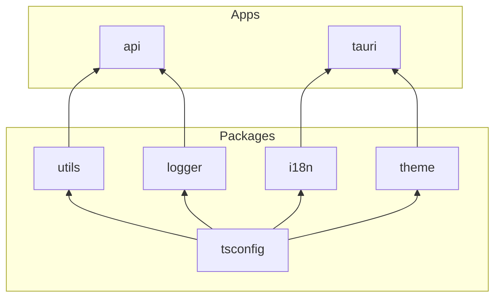

# Project Structure

## Apps

- [`@my-monorepo/api`](../apps/api) - Bun runtime API using Hono + tRPC, with shared logging/utilities.
- [`@my-monorepo/tauri`](../apps/tauri) - Tauri v2 desktop app (leedshack-digitialpet) with Vue 3 + Vite frontend.

## Packages

- [`@my-monorepo/tsconfig`](../packages/tsconfig) - Shared TypeScript base configs.
- [`@my-monorepo/utils`](../packages/utils) - Cross-app helpers for crypto/format/validation and shared libs (zod, validator, date-fns, jose, etc.).
- [`@my-monorepo/i18n`](../packages/i18n) - i18next setup with locale bundles.
- [`@my-monorepo/theme`](../packages/theme) - Theme helpers for light/dark/system.
- [`@my-monorepo/logger`](../packages/logger) - Pino-based logger with contextual helpers.

## Dependency Graph

> All packages depend on `tsconfig`. Apps use `api` as a devDependency for tRPC type inference.
